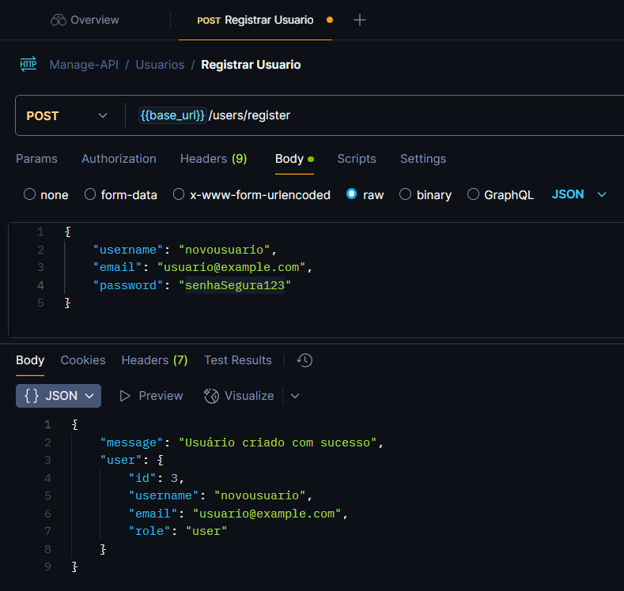
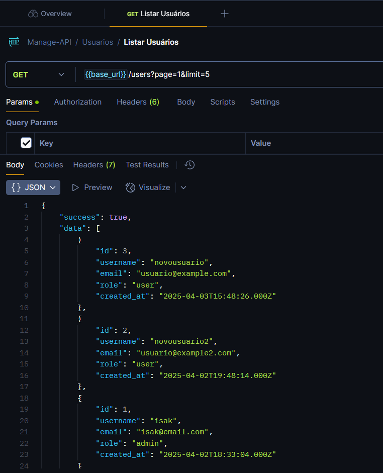
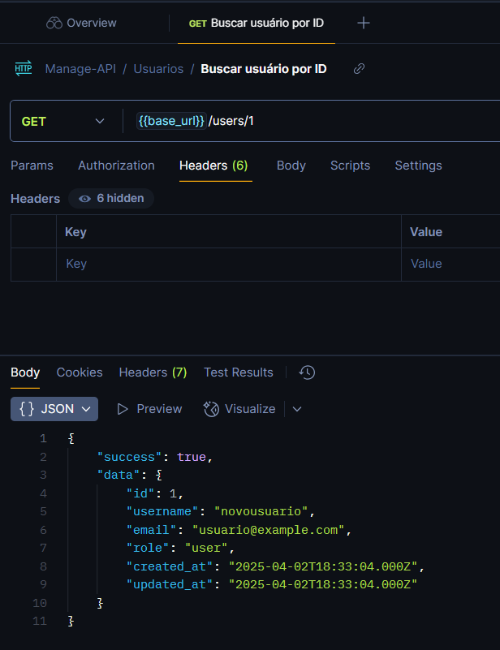
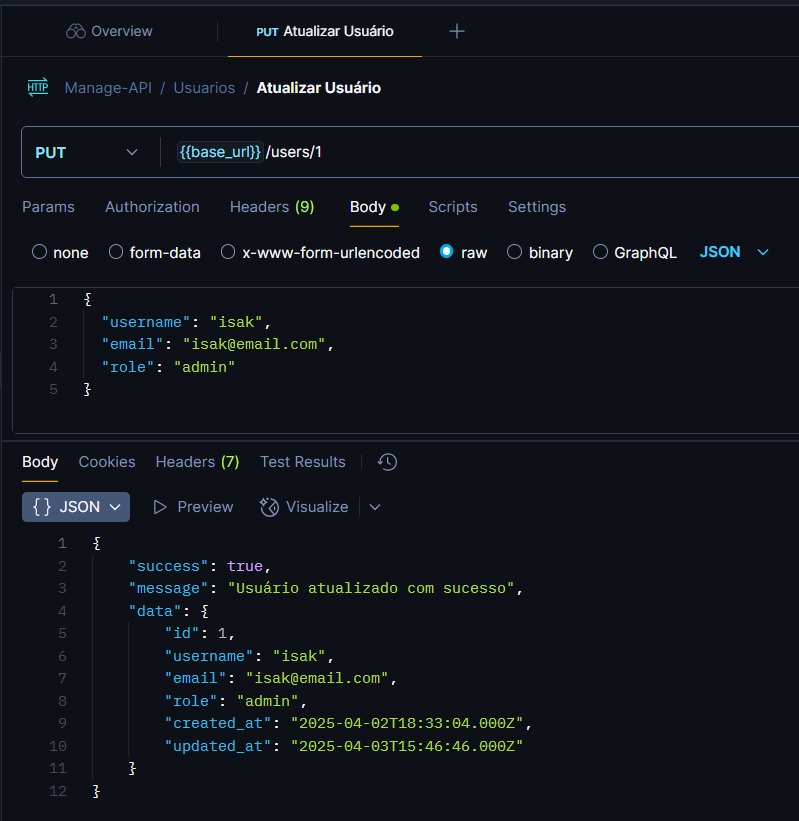
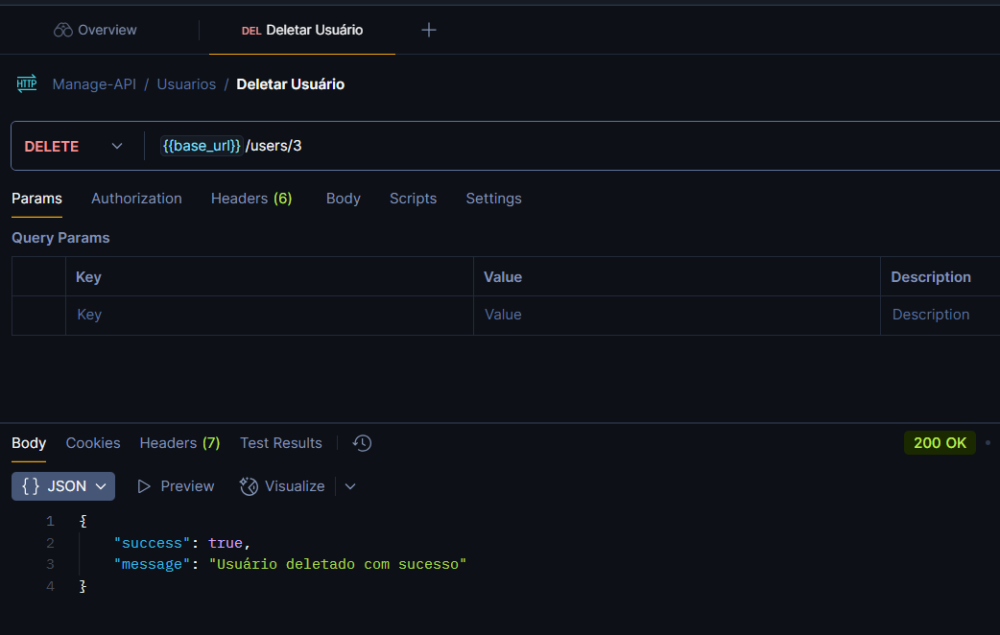
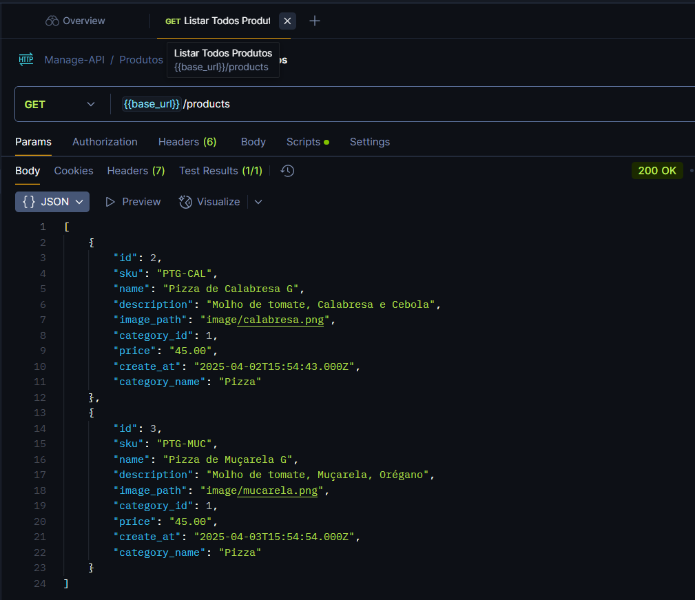
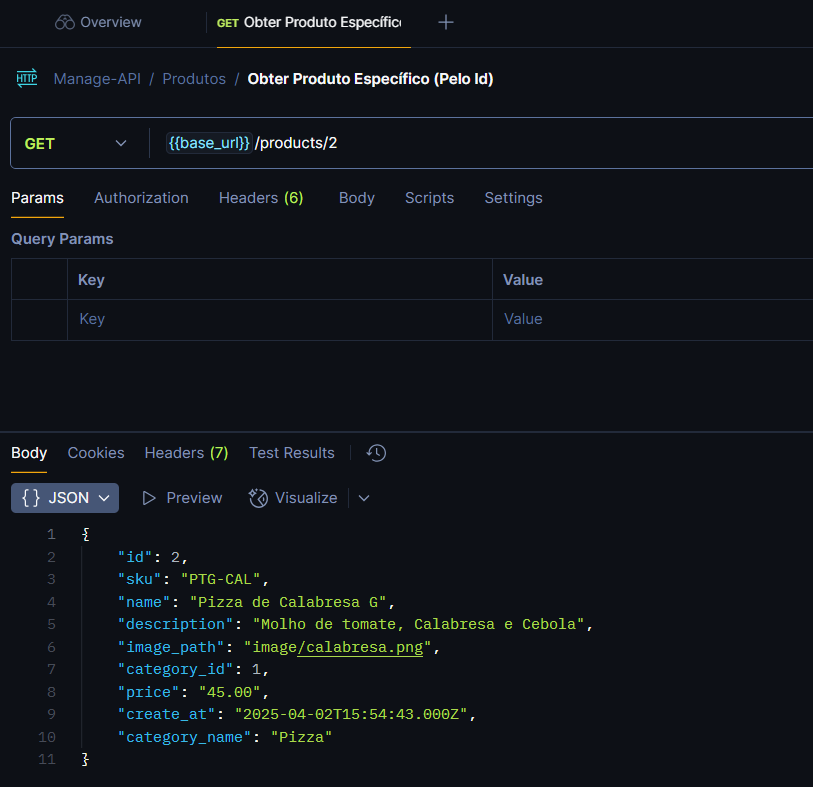
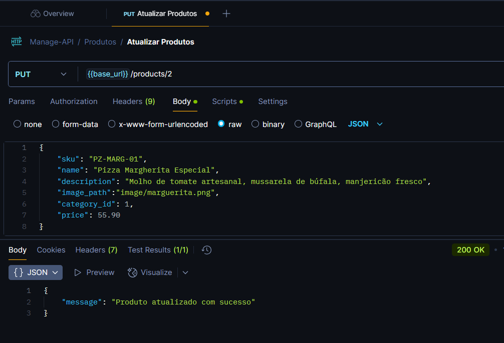

Sistema de Gerenciamento (Manage-API)

📌 1. Visão Geral
A Manage-API é uma aplicação backend desenvolvida em Node.js + MySQL seguindo o padrão MVC (Model-View-Controller). Ela inclui módulos para:

✅ Gerenciamento de Usuários  
✅ Gerenciamento de Produtos  
✅ Gerenciamento de Categorias

🔧 2. Estrutura MVC
| Camada | Descrição | Exemplo de Arquivos |
|--------|-----------|---------------------|
| Model |Lida com dados e regras de negócio (MySQL + Queries) | User.js, Product.js|
| View | Não aplicado (API REST) | (Retorno JSON) |
| Controller | Recebe requisições, valida dados e retorna respostas | userController.js, productController.js |
| Routes | Define endpoints e vincula aos controllers | userRoutes.js, productRoutes.js |

🔍 3. Validações Implementadas

📝 Usuários

- Nome: Obrigatório (3+ caracteres)

- Email: Formato válido + único

- Senha: Hash com bcryptjs + mínimo 8 caracteres

- Role: admin, manager ou user (padrão)

🍕 Produtos

- SKU: Único + obrigatório

- Preço: Decimal positivo

- Categoria: Deve existir no banco

🛠️ 4. Testes no Postman (Endpoints)

📌 Coleção de Screenshots
|Endpoint | Método | Screenshot (Exemplo) |
|---------|--------|----------------------|
POST /users | POST |  |
| GET /users | GET |  |
| GET /users/:id | GET |  |
| PUT /users/:id | PUT |  |
| DELETE /users/:id | DELETE |  |
| POST /products | POST |  |
| GET /products | GET |  |
| GET /products/:id | GET |  |
| PUT /products/:id | PUT |  |
| DELETE /products/:id | DELETE |  |

📚 4. Referências

[Documentação MySQL2](https://sidorares.github.io/node-mysql2/docs)

[Padrão MVC na Web](https://www.freecodecamp.org/news/the-model-view-controller-pattern-mvc-architecture-and-frameworks-explained/)

[BcryptJS (Hash de Senhas)](https://www.freecodecamp.org/news/how-to-hash-passwords-with-bcrypt-in-nodejs/)

[Postman Testing](https://learning.postman.com/docs/introduction/overview/)

🚀 5. Como Executar o Projeto?

📋 Pré-requisitos
MySQL Server instalado (versão 8.0 ou superior)

Acesso administrativo ao MySQL (usuário root ou com permissões para criar bancos)

🛠️ Passo a Passo para Criação Manual do Banco

1. Acesse o MySQL

```bash
 mysql -u root -p
 Digite sua senha quando solicitado
```

2. Crie o Banco de Dados

```sql
Copy
CREATE DATABASE managedb_test;
```

3. Verifique se foi criado

```sql
SHOW DATABASES;
Deve aparecer managedb_test na lista
```

```bash
# 1. Clone o repositório
git clone https://github.com/seu-usuario/manage-api.git

# 2. Instale as dependências
npm install

# 3. Configure o .env (copie de .env.example)
cp .env.example .env

# 4. Inicie o servidor
npm start
```
